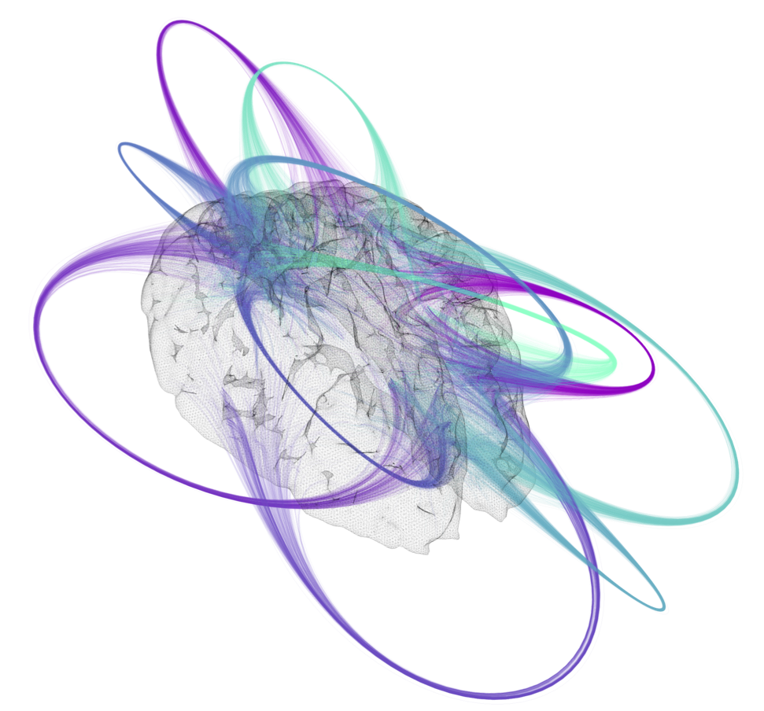

# Brain connectivity Paraview plugin

This repository contains a plugin that works inside Paraview for the visualization of connectivity data from fMRI scans of the brain.

## Reference

* [**Design of a visualization scheme for functional connectivity data of Human Brain**](https://is.tuebingen.mpg.de/publications/bramlage-2017), Lennart Bramlage, Bachelor Thesis,
  Hochschule Osnabrück - University of Applied Sciences, 2017.

## Documentation

The documentation can be found online on [read-the-doc](http://brain-data-vizualisation.readthedocs.io/en/latest/).
It covers the installation procedure and the utilities provided by the repository.

## License

The code is released under the MIT License

> Copyright 2018 Max Planck Society, Raffi Enficiaud, Lennart Bramlage
>
> Permission is hereby granted, free of charge, to any person obtaining a copy of this software and associated documentation files (the "Software"),
> to deal in the Software without restriction, including without limitation the rights to use, copy, modify, merge, publish, distribute, sublicense,
> and/or sell copies of the Software, and to permit persons to whom the Software is furnished to do so, subject to the following conditions:
>
> The above copyright notice and this permission notice shall be included in all copies or substantial portions of the Software.
>
> THE SOFTWARE IS PROVIDED "AS IS", WITHOUT WARRANTY OF ANY KIND, EXPRESS OR IMPLIED, INCLUDING BUT NOT LIMITED TO THE WARRANTIES OF MERCHANTABILITY,
> FITNESS FOR A PARTICULAR PURPOSE AND NONINFRINGEMENT. IN NO EVENT SHALL THE AUTHORS OR COPYRIGHT HOLDERS BE LIABLE FOR ANY CLAIM, DAMAGES OR OTHER
> LIABILITY, WHETHER IN AN ACTION OF CONTRACT, TORT OR OTHERWISE, ARISING FROM, OUT OF OR IN CONNECTION WITH THE SOFTWARE OR THE USE OR OTHER DEALINGS
> IN THE SOFTWARE.
